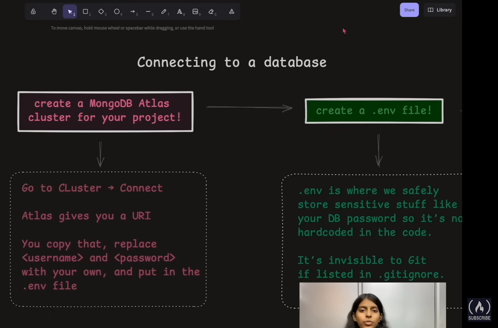
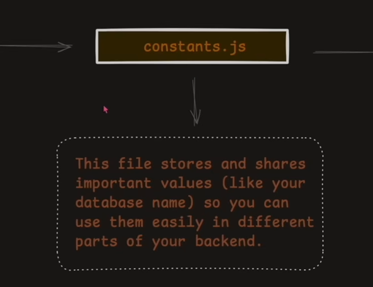
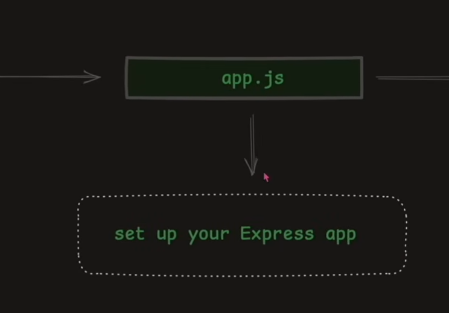
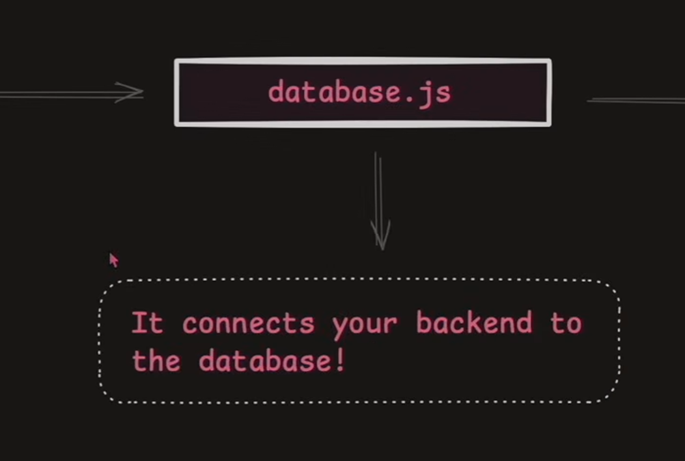
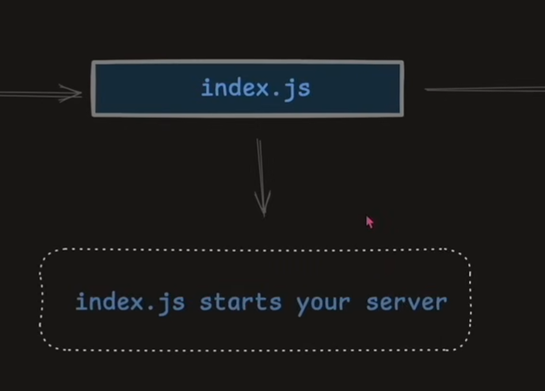
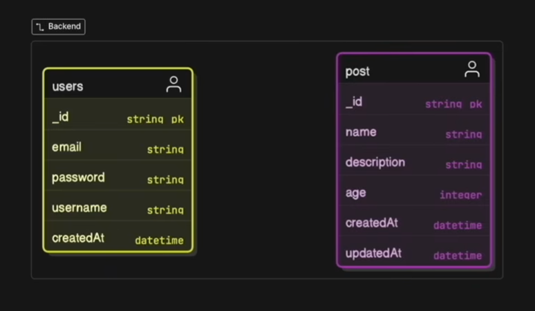
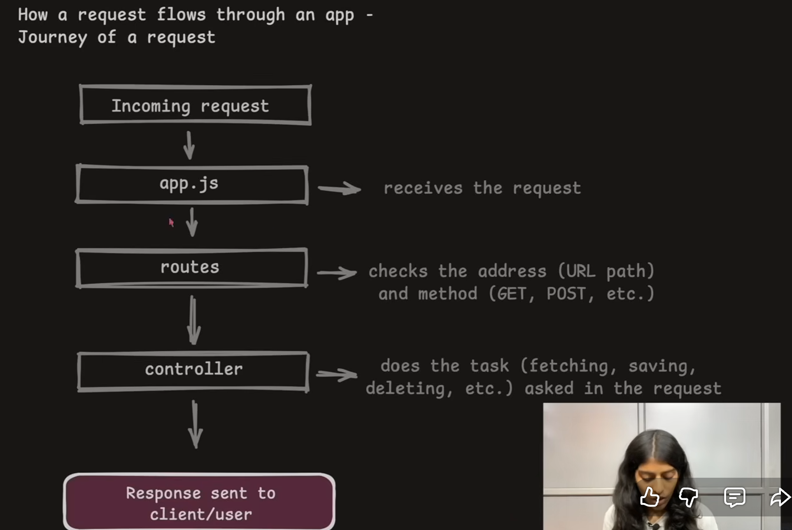
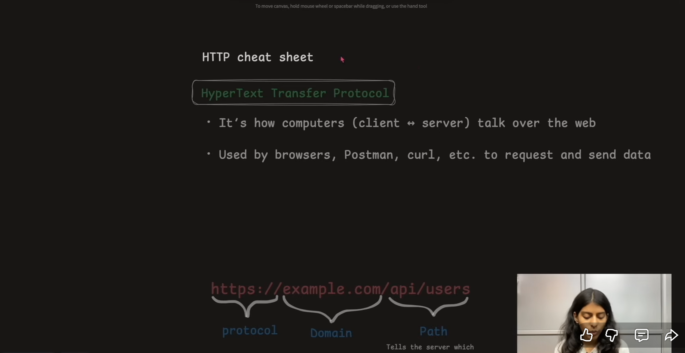
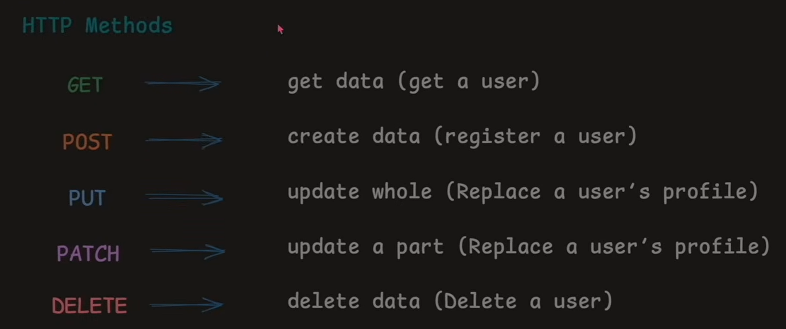
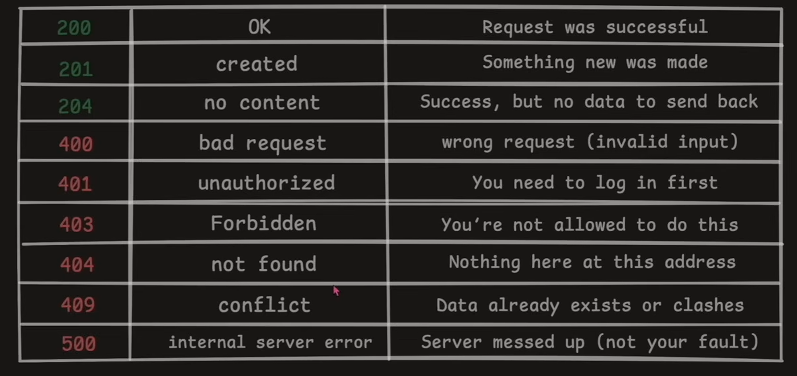

Youtube Src: https://www.youtube.com/watch?v=KOutPbKc9UM&t=1511s


https://nodejs.org/en/download
LTS most stable one to download

node -v

# Connect to Database
create a MongoDB Atlas cluster for your project


## MONGO
https://www.mongodb.com/products/platform/atlas-database

## Create cluster
username: acaciesong_db_user \
password: 9lYzwg9dlZ7l3raT

Connection method: Compass

.env is where we safely store sensitive stuff like your DB password so its not hardcoded in code.
Its invisible to Git if listed in .gitignore\


in package.json \ 
"type" is "commonjs" \
"type" is "module" (newer)


npm install express

https://mrkandreev.name/snippets/gitignore-generator/ \
Do for Node


database.js \
npm i mongoose



dotenv extract environmental variables? \
npm i dotenv

### Start Server
package.json \
```
"scripts": {
    "start": "node src/index.js",
    "dev": "nodemon src/indexjs"
  },
```
npm i nodemon \
(you are developer you want to start server again again, some automation -> nodemon, to start server again) whenever save file will updated \
npm run dev\


# API
application programming interface \
Structure: 
authentication
routes, controllers and structure and some modules \

# Model
What is a Model? \
Model is code version of structure of data you want in your website. \
This is an ER(Entity Relationship) diagram: \
- What kinds of data exist in our system
- How they relate to each other

user.model.js \
createdAt: dateTime -> when user was created
use this to get it: timestamps: true \

# Routes
user.route.js \
routes was where you handled the paths. \
So whenever a request came, it came to routes and routes take it to path where it needs to go, to specific path, to the specific route which the request needs to go on. \

## Controllers
user.controller.js \
Controllers are the things which really decide what kind of response has to be go on request. \
Decision makers. \ 
Handle what routes has come to them. Handle the request\

# How request flows through app




- s for security \
- domain \
- path \



- Get
- Post
- Put: update whole thing 
- Patch: just update a part of it
- Delete



- 200: request was successful
- 201: something new was made
- 400: bad request (invalid input)
- 404: Not Found
requested for some data, but doesn't exist
- 500: Server Messed up

# PostMan
https://www.postman.com
1. create workplace
2. Blank
3. Create
4. Create Collection: (ex: auth)
5. +Button on Collection to new request (ex: register)
6. app.js; example route (POST: http://localhost:4000/api/v1/users/register)
7. Headers: Content-Type application/json
8. Body: taken from the user. When a user trying to register on your website, they want to give some data, which we wrote in our controller. \
Select raw: Json \
Write Data here \
ex (so here we want register user): \ 
```
{
    "username": "Acacie",
    "email": "someEmail@gmail.com",
    "password":"123456"
}
```

